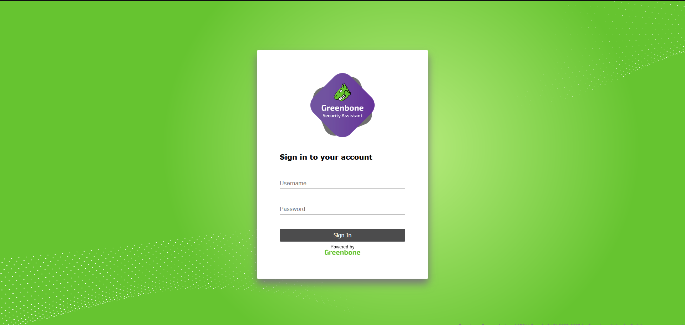

# How to OpenVas (GVM Greenbone Vulnerability Management)

---

## Instal·lació de GVM amb OpenVas per a Debian 11.


---

### Creació de l'usuari GVM.

Hem de crear l'usuari GVM per tal de que podem gestionar tota aquesta suit.

```
$sudo useradd -r -d /opt/gvm -c "GVM User" -s /bin/bash gvm
$sudo mkdir /opt/gvm && chown gvm: /opt/gvm
```
Seguidament, haurem d'instal·lar les dependències necesàries i diverses eines que ens ajudaran en el procés d'instal·lació.
```
$sudo apt install gcc g++ make bison flex libksba-dev \
curl redis libpcap-dev cmake git pkg-config libglib2.0-dev libgpgme-dev \
nmap libgnutls28-dev uuid-dev libssh-gcrypt-dev libldap2-dev gnutls-bin \
libmicrohttpd-dev libhiredis-dev zlib1g-dev libxml2-dev libnet-dev libradcli-dev \
clang-format libldap2-dev doxygen gcc-mingw-w64 xml-twig-tools libical-dev perl-base \
heimdal-dev libpopt-dev libunistring-dev graphviz libsnmp-dev python3-setuptools \
python3-paramiko python3-lxml python3-defusedxml python3-dev gettext python3-polib \
xmltoman python3-pip texlive-fonts-recommended \
texlive-latex-extra --no-install-recommends xsltproc sudo vim rsync -y
```

A continuació, instal·larem, Yarn, què és un gestor de paquets de Javasript.

```
$sudo curl -sL https://dl.yarnpkg.com/debian/pubkey.gpg | gpg --dearmor | sudo tee /usr/share/keyrings/yarnkey.gpg >/dev/null
$sudo echo "deb [signed-by=/usr/share/keyrings/yarnkey.gpg] https://dl.yarnpkg.com/debian stable main" | sudo tee /etc/apt/sources.list.d/yarn.list
$sudo apt update
$sudo apt install yarn -y
```

### Instal·lació i configuració de PostgreSQL per el backend de GVM.

La creació de la Base de Dades i de l'usuari que la controlarà, és l'usuari postgres de PostgreSQL
```
$sudo apt install postgresql-13 postgresql-contrib-13 postgresql-server-dev-13 -y
$sudo -Hiu postgres
$createuser gvm
$createdb -O gvm gvmd
$psql gvmd
$create role dba with superuser noinherit;
$grant dba to gvm;
$\q
```

### Creació i construcció del diversos mòduls de GVM.

Aquesta suit compta amb diversos mòduls que ens ajudaran en les diverses funcions de GVM.

```
* GVM Libraries
* OpenVAS Scanner
* OSPd
* OSPd-OpenVAS
* Greenbone Vulnerability Manager
* Greenbone Security Assistant
* Phyton-GVM
* GVM-Tools
* OpenVAS SMB
```
Per tal de fer aquest procés, ens convertirem en el usuari GVM, creat previament, i crearem un directori, on estaran ubicats, tots els mòduls per fer la instal·lació. Per descarregar-nos aquest mòduls, farem us del seu Repositori Oficial de [GitHub](https://github.com/greenbone/).
```
$su - gvm
$mkdir gvm-source
$cd gvm-source
$git clone -b stable --single-branch https://github.com/greenbone/gvm-libs.git
$git clone -b main --single-branch https://github.com/greenbone/openvas-smb.git
$git clone -b stable --single-branch https://github.com/greenbone/openvas.git
$git clone -b stable --single-branch https://github.com/greenbone/ospd.git
$git clone -b stable --single-branch https://github.com/greenbone/ospd-openvas.git
$git clone -b stable --single-branch https://github.com/greenbone/gvmd.git
$git clone -b stable --single-branch https://github.com/greenbone/gsa.git
$git clone -b stable --single-branch https://github.com/greenbone/gsad.git
```

Abans de començar a instal·lar els diversos mòduls, ens hem d'assegurar-nos d'instal·lar les llibreres de GVM, per poder fer la resta de la instal·lació. Les comandes les executarem com a l'usuari gvm.

```
$cd gvm-libs
$mkdir build && cd build
$cmake ..
$make
$sudo make install
```
---

Seguidament, instal·larem i configurarem l'OpenVAS Scanner i l'OpenVAS SMB.

***Open Vulnerability Assessment Scanner (OpenVAS) is a full-featured scan engine that executes a continuously updated and extended feed of Network Vulnerability Tests (NVTs).

OpenVAS SMB provides modules for the OpenVAS Scanner to interface with Microsoft Windows Systems through the Windows Management Instrumentation API and a winexe binary to execute processes remotely on that system.***


```
OpenVAS-SMB

$cd ../../openvas-smb/
$mkdir build && cd build
$cmake ..
$make
$sudo make install

OpenVAS Scanner
$cd ../../openvas
$[ -d build ] || mkdir build && cd build
$cmake ..
$make
$sudo make install
```

### Configuració de OpenVas Scanner.

Ara és hora de configurar l'Scanner propiàment dit, per fer això farem ús del servidor Redis. *El servidor Redis el farem servir per emmagatzemar les dades a l'hora de fer un escanneig a un host.*
```
$exit
$ldconfig
*El fitxer per defecte del servidor Redis és el: /etc/redis/redis.conf*
$cp /opt/gvm/gvm-source/openvas/config/redis-openvas.conf /etc/redis/
$chown redis:redis /etc/redis/redis-openvas.conf
$grep unixsocket /etc/redis/redis-openvas.conf
Sortida:
unixsocket /run/redis-openvas/redis.sock
unixsocketperm 770
$echo "db_address = /run/redis-openvas/redis.sock" > /etc/openvas/openvas.conf
*Afegim l'usuari gvm al grup de Redis*
```
### Actualització de la Network Vulnerability Tests (NVTs).

Ara farem una sincronització de les bases de dades de NVTs de la Greenbone Security Feed/Community Feed, per tal de fer això executarem la ordre *greenbone-nvt-sync*.

Ens hem d'assegurar abans que l'usuari gvm, pugui tenir accés al següent directori, */var/lib/openvas/*, ja que aquest directori està destinat a les llibreries pròpies de OpenVas.

```
$chown -R gvm: /var/lib/openvas/ 
```

Ara ja podem executar la comanda,*greenbone-nvt-sync*, l'haurem d'executar sense ser root.
```
$su 'gvm
#greenbone-nvt-sync
```
Jus quan finalitzi, haurem de desar aquesta informació actualitzada de les NVTs al servidor Redis.
```
$sudo openvas --update-vt-info
```

### Instal·lació de Greenbone Vulnerability Manager.

```
$cd gvm-source/gvmd
$mkdir build && cd build
$cmake ..
$make
$sudo make install
```
### Greenbone Security Assistant (Interfície Web).

Ara instal·larem la interfície gàfica web per poder controlar l'OpenVas i tota la configuració que porta el Greenbone Security Assistant.

```
$cd ../../gsa
$rm -rf build
$yarn
$yarn build
```
Seguidament farem el mateix amb el servidor HTTP per poder accedira a dita interfície gràfica mitjançant la web.

```
$cd ../../gsad
$mkdir build && cd build
$cmake ..
$make
$sudo make install
$[[ -d /usr/local/share/gvm/gsad/web ]] || mkdir -p /usr/local/share/gvm/gsad/web
$chown -R gvm: /usr/local/share/gvm/gsad/web
$cp -rp /opt/gvm/gvm-source/gsa/build/* /usr/local/share/gvm/gsad/web
```

### Actualització de plugins de GVM (DATA, CERT, SCAP).

```
$chown -R gvm: /var/lib/gvm/
$sudo -u gvm greenbone-feed-sync --type GVMD_DATA
$sudo -u gvm greenbone-feed-sync --type SCAP
$sudo -u gvm greenbone-feed-sync --type CERT
```
Amb això tindrem tots els plugins de les bases de dades de vulnerabilitats actualitzades. Es recomana molt que tinguem aquets ordres al crontab, per tal d'automatizar les actualitzacions. 

### Instal·lació de OSPd i OSPd-OpenVas.

L'OSPd, és el dimoni que activa l'Open Scanner Protocol, que serà l'encarregat de portar a terme els diversos escanneig que anem fent. A més ho podrem controlar fàcilment amb el *GVM Service*.

```
$su - gvm
$ip3 install wheel
$pip3 install python-gvm gvm-tools
$cd /opt/gvm/gvm-source/ospd
$python3 -m pip install .
$cd /opt/gvm/gvm-source/ospd-openvas
$python3 -m pip install .
```

### Generació de GVM Certificates

Ara hem de generar els certficats del GVMd, ja que els necessitarem per al servidor per autenticar. PEr això executarem la següent comanda.

```
$sudo -u gvm gvm-manage-certs -a
```

### Creació i posada en marxa dels diferents serveis necessaris, GVM, GSA, GVM Scanner.

Ara ja podem crear els diversos que haurem de fer servir.

*Servei del Systemd OpenVas-Open Scanner Protocol Daemon.*
```
cat > /etc/systemd/system/ospd-openvas.service << 'EOL'
[Unit]
Description=OSPd Wrapper for the OpenVAS Scanner (ospd-openvas)
After=network.target networking.service redis-server@openvas.service postgresql.service
Wants=redis-server@openvas.service
ConditionKernelCommandLine=!recovery

[Service]
ExecStartPre=-rm -rf /var/run/gvm/ospd-openvas.pid /var/run/gvm/ospd-openvas.sock
Type=simple
User=gvm
Group=gvm
RuntimeDirectory=gvm
Environment=PATH=/usr/local/sbin:/usr/local/bin:/usr/sbin:/usr/bin:/sbin:/bin:/usr/games:/usr/local/games:/opt/gvm/bin:/opt/gvm/sbin:/opt/gvm/.local/bin
ExecStart=/opt/gvm/.local/bin/ospd-openvas \
--pid-file /var/run/gvm/ospd-openvas.pid \
--log-file /var/log/gvm/ospd-openvas.log \
--lock-file-dir /var/run/gvm -u /var/run/gvm/ospd-openvas.sock
RemainAfterExit=yes

[Install]
WantedBy=multi-user.target
EOL
```

Aquest serà el servei de OpenVas-OSPd, el dimoni que controlar el protocol Open Scanner. 

```
$[[ -d /var/run/gvm ]] || mkdir /var/run/gvm
$chown -R gvm: /var/run/gvm /var/log/gvm
$systemctl daemon-reload
$Start and enable OSPD openvas wrapper service;
$systemctl enable --now ospd-openvas
$systemctl status ospd-openvas.service
```

*Servei del Systemd per el Greenbone Vulnerability Manager.*

```
cat > /lib/systemd/system/gvmd.service << 'EOL'
[Unit]
Description=Greenbone Vulnerability Manager daemon (gvmd)
After=network.target networking.service postgresql.service ospd-openvas.service
Wants=postgresql.service ospd-openvas.service
Documentation=man:gvmd(8)
ConditionKernelCommandLine=!recovery

[Service]
Type=forking
User=gvm
Group=gvm
RuntimeDirectory=gvmd
Environment=PATH=/usr/local/sbin:/usr/local/bin:/usr/sbin:/usr/bin:/sbin:/bin:/usr/games:/usr/local/games:/opt/gvm/bin:/opt/gvm/sbin:/opt/gvm/.local/bin
ExecStart=/usr/local/sbin/gvmd --osp-vt-update=/var/run/gvm/ospd-openvas.sock
Restart=always
TimeoutStopSec=10

[Install]
WantedBy=multi-user.target
EOL
```

```
$systemctl daemon-reload
$systemctl enable --now gvmd
$systemctl status gvmd
```

*Servei de Systemd de GSA.*
```
cat > /lib/systemd/system/gsad.service << 'EOL'
[Unit]
Description=Greenbone Security Assistant daemon (gsad)
Documentation=man:gsad(8) https://www.greenbone.net
After=network.target gvmd.service
Wants=gvmd.service

[Service]
Type=simple
User=gvm
Group=gvm
RuntimeDirectory=gsad
PIDFile=/var/run/gsad/gsad.pid
Environment=PATH=/usr/local/sbin:/usr/local/bin:/usr/sbin:/usr/bin:/sbin:/bin:/usr/games:/usr/local/games:/opt/gvm/bin:/opt/gvm/sbin:/opt/gvm/.local/bin
ExecStart=/usr/bin/sudo /usr/local/sbin/gsad -k /var/lib/gvm/private/CA/clientkey.pem -c /var/lib/gvm/CA/clientcert.pem
RemainAfterExit=yes

[Install]
WantedBy=multi-user.target
EOL
```

```
Fem que l'usuari gvm pugui executar el gsad sense necessitat de ser root:
$echo "gvm ALL = NOPASSWD: $(which gsad)" >> /etc/sudoers.d/gvm
$systemctl daemon-reload
$systemctl enable --now gsad
$systemctl status gsad
```

*Creació del GVM Scanner*.

Ara hem de crear el Scanner pròpiament dit, ja que el necessitarem, perquè per defecte no ens ve cap escanner creat. Per això amb la comanda *gvmd* ho podrem fer personalitzat.

```
$sudo -u gvm gvmd --create-scanner="Projecte-ASIX OpenVAS Scanner" \
--scanner-type="OpenVAS" --scanner-host=/var/run/gvm/ospd-openvas.sock

Scanner Created

Ara comprovem que tenim el escanner creat.
$sudo -u gvm gvmd --get-scanners

Ens generarà una sortida semblant a la següent:
08b69003-5fc2-4037-a479-93b440211c73  OpenVAS  /run/ospd/ospd-openvas.sock  0  OpenVAS Default
6acd0832-df90-11e4-b9d5-28d24461215b  CVE    0  CVE
6e0c2bec-9688-430d-b8da-f59a7c27fbe7  OpenVAS  /var/run/gvm/ospd-openvas.sock  9390  Projecte-ASIX OpenVAS Scanner 

```

Verificarem que l'escanner és el nostre, per això farem ús de la UUID que ens ha generat de l'escanner què prèviament hem creat per verificar-ho.

```
$sudo -u gvm gvmd --verify-scanner=6e0c2bec-9688-430d-b8da-f59a7c27fbe7

Sortida de la comanda.

Scanner version: OpenVAS 21.4.3~dev1~git-3e7b6d3f-openvas-21.04.
```

### Creació de l'usuari de la Interfície web gràfica.

Amb la següent comanda podrem crear l'usuari web amb una contrasenya aleatoria, però també podem decidir nosaltres el nom d'usuari i la seva contrasenya.

```
Usuari admin amb contrasenya aleatoria
$sudo -u gvm gvmd --create-user admin

Sortida:

User created with password '3ae45864-0d6a-4a53-938f-730a1bb5d959'.

```

```
Usuari admin amb la nostra contrasenya.
$sudo -u gvm gvmd --create-user admin --password=PASSWORD

Per canviar la contrasenya d'un usuari existent.
$sudo -u gvm gvmd --user=<USERNAME> --new-password=<PASSWORD>
```

Ara ens cal establit el propietari de la feed de les actualitzacions fetes abans, per això necessitem que el propietari sigui el que hem creat anteriorment. Volem que les configuaracions siguin de l'usuari d'abans.

```
$sudo -u gvm gvmd --modify-setting 78eceaec-3385-11ea-b237-28d24461215b --value <uuid_of_user>

Els UUIDs dels usuaris creats els aconseguim executant la següent comanda:

$sudo -u gvm gvmd --get-users --verbose

*Sortida*

admin bb3bd8a6-6b77-464f-9f9b-1afe4835be15

Ara am el UUID, ja podem modificar les configuracions
$sudo -u gvm gvmd --modify-setting 78eceaec-3385-11ea-b237-28d24461215b --value bb3bd8a6-6b77-464f-9f9b-1afe4835be15
```

### Accedir a la Interfície web de GVM.

El servei GSA obre el port 443 i escoltar per totes les interícies de xarxa que tinguem configurades. Ho comprovem amb la comanda:

``` 
ss -altnp | grep 443
```

Ara accedim mitjançant la URL: *https:serverIP-OR-hostname>*. Ara em d'acceptar el certificat autosignat per accedir-hi.

### Captures de Pantalla de la Interfície web.



Pantalla d'inici


Pestanya de la llista d'escanneigs fets.

