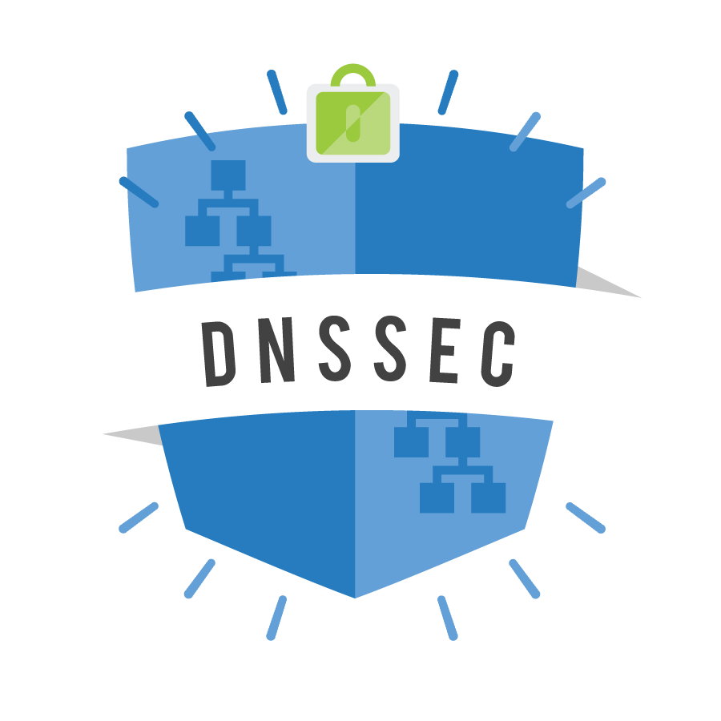

# Projecte ASIX
## M14 Projecte. Curs 2021-2022
### Albert Blanco i Jamison Quelal
---
#### En el nostre projecte hem estat treballant en dos serveis molt utilitzats que son:

##### OpenVas
###### Es un software que ens permet fer analisis de seguretat, si desitja mes informació pot llegir el howto d'acontinuació:
[How to OpenVas](https://github.com/isx24432143/Projecte-ASIX/blob/master/HowToOpenVas.pdf)

##### DNS+DNSSEC
###### Son serveis que utilitzem diariament i veurem primer el servei DNS normal que podrem, veure les seves vulnerabilitats i despres com amb la seguretat ens permet solucionar les vulnerabilitats, si vols llegir mes al respecte pots llegir el pdf següent:
[How to DNS+DNSSEC]([https://github.com/isx24432143/Projecte-ASIX/blob/master/howtobind9.md](https://github.com/isx24432143/Projecte-ASIX/blob/master/howto_dns_dnssec.md))
