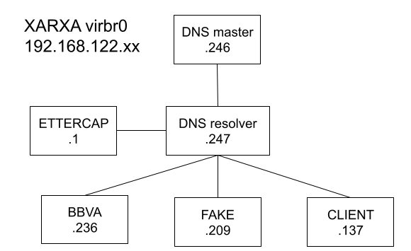
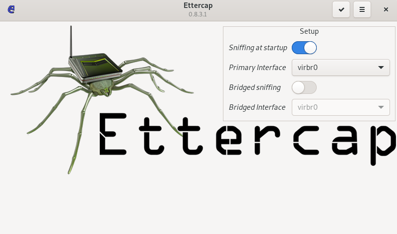
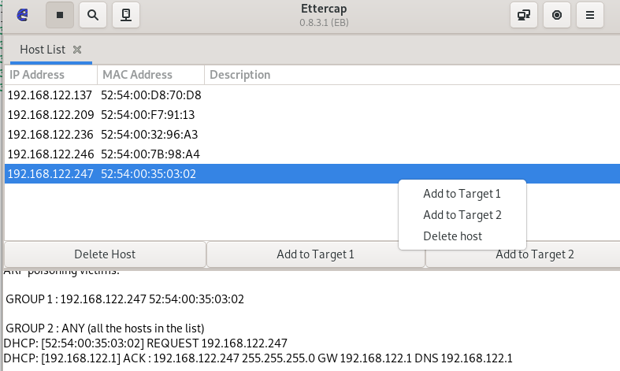
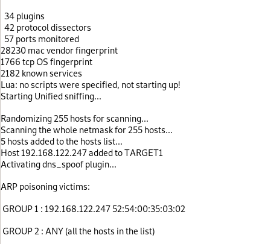
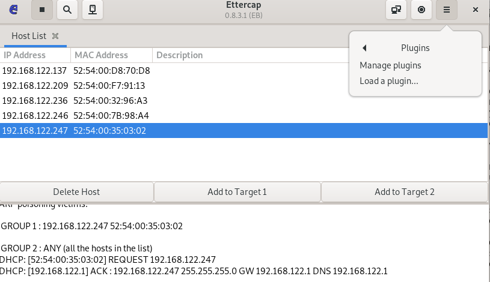
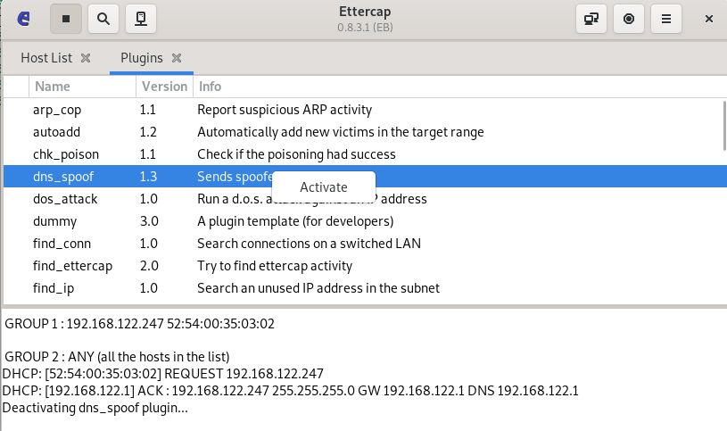
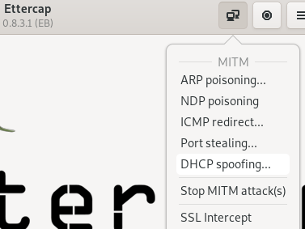
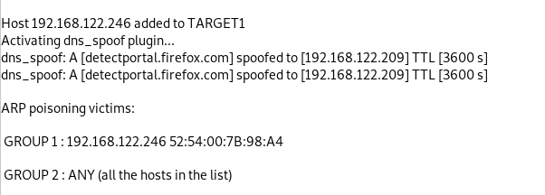

# How to DNS

---

### Instal·lar bind9
Debian: apt-get install bind9  
Fedora: dnf -y install bind9

---

### Bind9 Administrator's guide

/usr/share/doc/bind9  
/usr/share/doc/bind9-doc/  
/usr/share/doc/bind9-libs/  
/usr/share/doc/bind9-dnsutils/  
/usr/share/doc/bind9-host/  

---

### Descripció

Berkeley Internet Name Domain (BIND) is the most popular Domain Name System (DNS) server in use today. It was developed in the 1980s at the University of Berkley and is currently in version 9.
BIND can be used to run a caching DNS server or an authoritative name server, and provides features like load balancing, notify, dynamic update, split DNS, DNSSEC, IPv6, and more

---

### Bind9 Terminology

Following is a list of elements used throughout the BIND configuration file documentation:


acl_name
   The name of an address_match_list as defined by the acl statement.

address_match_list
   A list of one or more ip_addr, ip_prefix, key_id, or acl_name elements; see Address Match Lists.

remoteserver_list
   A named list of one or more ip_addr with optional key_id and/or ip_port. A remoteserver_list may include other remoteserver_list.

domain_name
   A quoted string which is used as a DNS name; for example. my.test.domain.

namelist
   A list of one or more domain_name elements.

dotted_decimal
   One to four integers valued 0 through 255 separated by dots (.), such as 123.45.67 or 89.123.45.67.
ip4_addr
   An IPv4 address with exactly four elements in dotted_decimal notation.

ip6_addr
   An IPv6 address, such as 2001:db8::1234. IPv6-scoped addresses that have ambiguity on their scope zones must be disambiguated by an appropriate zone ID with the percent character (%) as a delimiter. It is strongly recommended to use
   string zone names rather than numeric identifiers, to be robust against system configuration changes. However, since there is no standard mapping for such names and identifier values, only interface names as link identifiers are
   supported, assuming one-to-one mapping between interfaces and links. For example, a link-local address fe80::1 on the link attached to the interface ne0 can be specified as fe80::1%ne0. Note that on most systems link-local addresses
   always have ambiguity and need to be disambiguated.

ip_addr
   An ip4_addr or ip6_addr.

ip_dscp
   A number between 0 and 63, used to select a differentiated services code point (DSCP) value for use with outgoing traffic on operating systems that support DSCP.

ip_port
   An IP port number. The number is limited to 0 through 65535, with values below 1024 typically restricted to use by processes running as root. In some cases, an asterisk (*) character can be used as a placeholder to select a random
   high-numbered port.

ip_prefix
   An IP network specified as an ip_addr, followed by a slash (/) and then the number of bits in the netmask. Trailing zeros in an``ip_addr`` may be omitted. For example, 127/8 is the network 127.0.0.0``with netmask ``255.0.0.0 and
   1.2.3.0/28 is network 1.2.3.0 with netmask 255.255.255.240. When specifying a prefix involving a IPv6-scoped address, the scope may be omitted. In that case, the prefix matches packets from any scope.

key_id
   A domain_name representing the name of a shared key, to be used for transaction security.

key_list
   A list of one or more key_id, separated by semicolons and ending with a semicolon.

number
   A non-negative 32-bit integer (i.e., a number between 0 and 4294967295, inclusive). Its acceptable value might be further limited by the context in which it is used.

fixedpoint
   A non-negative real number that can be specified to the nearest one-hundredth. Up to five digits can be specified before a decimal point, and up to two digits after, so the maximum value is 99999.99. Acceptable values might be further limited by the contexts in which they are used.

path_name
   A quoted string which is used as a pathname, such as zones/master/my.test.domain.

port_list
   A list of an ip_port or a port range. A port range is specified in the form of range followed by two ip_port``s, ``port_low and port_high, which represents port numbers from port_low through port_high, inclusive. port_low must not be
   larger than port_high. For example, range 1024 65535 represents ports from 1024 through 65535. In either case an asterisk (*) character is not allowed as a valid ip_port.

size_spec
   A 64-bit unsigned integer, or the keywords unlimited or default. Integers may take values 0 <= value <= 18446744073709551615, though certain parameters (such as max-journal-size) may use a more limited range within these extremes.
   In most cases, setting a value to 0 does not literally mean zero; it means “undefined” or “as big as possible,” depending on the context. See the explanations of particular parameters that use size_spec for details on how they
   interpret its use. Numeric values can optionally be followed by a scaling factor: K or k for kilobytes, M or m for megabytes, and G or g for gigabytes, which scale by 1024, 1024*1024, and 1024*1024*1024 respectively.
   unlimited generally means “as big as possible,” and is usually the best way to safely set a very large number. default uses the limit that was in force when the server was started.

size_or_percent
   A size_spec or integer value followed by % to represent percent. The behavior is exactly the same as size_spec, but size_or_percent also allows specifying a positive integer value followed by the % sign to represent percent.

yes_or_no
   Either yes or no. The words true and false are also accepted, as are the numbers 1 and 0.

dialup_option
   One of yes, no, notify, notify-passive, refresh, or passive. When used in a zone, notify-passive, refresh, and passive are restricted to secondary and stub zones.

---

### Elements clau

Domains
   A domain is a logical group of computers in a large network. Access to each computer in a given group is controlled by the same server.

Distributed Database
   A distributed database is an archive of information about the computers in a network.

Name Servers
   A name server contains address information about other computers on the network. This information can be given to client computers that make a request to the name server.

Clients
   A client requests information from the servers. In a domain name system, the client requests network addressing information from the name servers.

Resolver
   A resolver provides clients with address information about other computers on the network.

Model de funcionament
   The Domain Name System (DNS) is a hierarchical, distributed database. It stores information for mapping Internet host names to IP addresses and vice versa, mail routing information, and other data used by Internet applications.
   Clients look up information in the DNS by calling a resolver library, which sends queries to one or more name servers and interprets the responses. The BIND 9 software distribution contains a name server, named,
   and a set of associated tools.

---

### Instal·lació bind9

 Procediment a seguir:

1. Instal·lar el paquet bind9 
2. Configurar el fitxer /etc/bind/named.conf.options  
3. Configurar el fitxer /etc/bind/named.conf.default-zones 
4. Configurar el fitxer db.(domini) en el nostre cas es db.edt 
5. Configurar dns del client per posar el del nostre dns 
---

### Imatge de com tenim organitzada la xarxa



---

#### Configuració servidors web

##### Servidor real

```
root@nginxreal:~# apt-get install apache2
Reading package lists... Done
Building dependency tree... Done
Reading state information... Done
apache2 is already the newest version (2.4.53-1~deb11u1).
0 upgraded, 0 newly installed, 0 to remove and 1 not upgraded.

root@nginxreal:~# vim /etc/resolv.conf 
nameserver 192.168.122.247

root@nginxreal:~# host bbva.edt
bbva.edt has address 192.168.122.236
root@nginxreal:~# host bbvafake.edt
bbvafake.edt has address 192.168.122.209

root@nginxreal:~# ip a s enp1s0
2: enp1s0: *<BROADCAST,MULTICAST,UP,LOWER_UP>* mtu 1500 qdisc pfifo_fast state UP group default qlen 1000
    link/ether 52:54:00:32:96:a3 brd ff:ff:ff:ff:ff:ff
    inet 192.168.122.236/24 brd 192.168.122.255 scope global dynamic enp1s0
       valid_lft 3559sec preferred_lft 3559sec
    inet6 fe80::5054:ff:fe32:96a3/64 scope link 
       valid_lft forever preferred_lft forever

root@nginxreal:~# ping bbvafake.edt
PING bbvafake.edt (192.168.122.209) 56(84) bytes of data.
64 bytes from 192.168.122.209 (192.168.122.209): icmp_seq=1 ttl=64 time=0.639 ms
64 bytes from 192.168.122.209 (192.168.122.209): icmp_seq=2 ttl=64 time=0.698 ms
--- bbvafake.edt ping statistics ---
2 packets transmitted, 2 received, 0% packet loss, time 1002ms
rtt min/avg/max/mdev = 0.639/0.668/0.698/0.029 ms
```

##### Servidor fake

```
root@fake:~# apt-get install apache2
Reading package lists... Done
Building dependency tree... Done
Reading state information... Done
apache2 is already the newest version (2.4.53-1~deb11u1).
0 upgraded, 0 newly installed, 0 to remove and 1 not upgraded.

root@fake:~# vim /etc/resolv.conf
nameserver 192.168.122.247

root@fake:~# host bbva.edt
bbva.edt has address 192.168.122.236
root@fake:~# host bbvafake.edt
bbvafake.edt has address 192.168.122.209

root@fake:~# ip a s enp1s0
2: enp1s0: *<BROADCAST,MULTICAST,UP,LOWER_UP>* mtu 1500 qdisc pfifo_fast state UP group default qlen 1000
    link/ether 52:54:00:f7:91:13 brd ff:ff:ff:ff:ff:ff
    inet 192.168.122.209/24 brd 192.168.122.255 scope global dynamic enp1s0
       valid_lft 2366sec preferred_lft 2366sec
    inet6 fe80::5054:ff:fef7:9113/64 scope link 
       valid_lft forever preferred_lft forever

root@fake:~# ping bbva.edt
PING bbva.edt (192.168.122.236) 56(84) bytes of data.
64 bytes from 192.168.122.236 (192.168.122.236): icmp_seq=1 ttl=64 time=1.33 ms
64 bytes from 192.168.122.236 (192.168.122.236): icmp_seq=2 ttl=64 time=0.720 ms
--- bbva.edt ping statistics ---
2 packets transmitted, 2 received, 0% packet loss, time 1002ms
rtt min/avg/max/mdev = 0.720/1.024/1.329/0.304 ms
```
---
#### Configuració servidors dns

##### Servidor resolver

```
root@resolver:~# apt-get install bind9
Reading package lists... Done
Building dependency tree... Done
Reading state information... Done
bind9 is already the newest version (1:9.16.27-1~deb11u1).
0 upgraded, 0 newly installed, 0 to remove and 1 not upgraded.

root@resolver:~# vim /etc/bind/named.conf.options 
options {
        directory "/var/cache/bind";
        forwarders {
                192.168.122.246;
        };
        allow-query {
                any;
        };
        forward only;
        //
        dnssec-validation no;
        recursion yes;
};
```

##### Servidor master
```
root@master:~# apt-get install bind9
Reading package lists... Done
Building dependency tree... Done
Reading state information... Done
bind9 is already the newest version (1:9.16.27-1~deb11u1).
0 upgraded, 0 newly installed, 0 to remove and 1 not upgraded.

root@master:~# vim /etc/bind/named.conf.default-zones 
zone "." {
        type hint;
        file "/usr/share/dns/root.hints";
};
zone "localhost" {
        type master;
        file "/etc/bind/db.local";
};
zone "127.in-addr.arpa" {
        type master;
        file "/etc/bind/db.127";
};
zone "0.in-addr.arpa" {
        type master;
        file "/etc/bind/db.0";
};
zone "255.in-addr.arpa" {
        type master;
        file "/etc/bind/db.255";
};
zone "edt" {
    type master;
    file "/etc/bind/db.edt";
};

root@master:~# vim /etc/bind/db.edt 
@ SOA ns root 1 4 4 4 4
         NS ns
        A       192.168.122.246
ns      A       192.168.122.246
bbva            A       192.168.122.236
bbvafake        A       192.168.122.209
```
---

#### Configuració ettercap

```
isx47320900@i03:~$ sudo apt-get install ettercap-graphical 
Reading package lists... Done
Building dependency tree... Done
Reading state information... Done
ettercap-graphical is already the newest version (1:0.8.3.1-3).
0 upgraded, 0 newly installed, 0 to remove and 30 not upgraded.


isx47320900@i03:~$ sudo vim /etc/ettercap/etter.dns
*        A 192.168.122.209
```

***‎‍‍‍‍‍‎ ‏‏‎‎ ‏‏‎‎ ‏‏‎‏‏‎‎ ‏‏‎‎ ‎‍‍‍‍‍‎ ‏‏‎‎ ‏‏‎‎ ‏‏‎‏‏‎‎ ‏‏‎‎ ‎‍‍‍‍‍‎ ‏‏‎‎ ‏‏‎‎ ‎‍‍‍‍‍‎ ‏‏‎‎ ‏‏‎‎ ‏‏‎‏‏‎‎ ‏‏‎‎ ‎‍‍‍‍‍‎ ‏‏‎‎ ‏‏‎‎ ‏‏‎‏‏‎‎ ‏‏‎‎ ‎‍‍‍‍‍‎  ‎‍‍‍‍‍‎ ‏‏‎‎ ‏‏‎‎ ‏‏‎‏‏‎‎ ‏‏‎‎ ‎‍‍‍‍‍‎ ‏‏‎‎ ‏‏‎‎ ‏‏‎‎ ‏‏‎‎ ‏‏‎‏‏‎‎  ‎‍‍‍‍‍‎ ‏‏‎‎ ‏‏‎‎ ‏‏‎‏‏‎‎‏‎‎ ‏‏‎‏‏‎‎ ‏‏‎‎ ‎‍‍‍‍‍‎ ‏‏‎‎ ‏‏‎‎  ‏‏‎‎ ‏‏‎‏‏‎‎ ‏‏‎‎ ‎‍‍‍‍‍‎ ‏‏‎‎ ‏‏‎‎ ‏‏‎‏‏‎‎  ‏‏‎‎Posem la interficie de xarxa virtual que utilitzem***


***‎‍‍‍‍‍‎ ‏‏‎‎ ‏‏‎‎ ‏‏‎‏‏‎‎ ‏‏‎‎ ‎‍‍‍‍‍‎ ‏‏‎‎ ‏‏‎‎ ‏‏‎‏‏‎‎ ‏‏‎‎ ‎‍‍‍‍‍‎ ‏‏‎‎ ‏‏‎‎ ‎‍‍‍‍‍‎ ‏‏‎‎ ‏‏‎‎ ‏‏‎‏‏‎‎ ‏‏‎‎ ‎‍‍‍‍‍‎ ‏‏‎‎ ‏‏‎‎ ‏‏‎‏‏‎‎ ‏‏‎‎ ‎‍‍‍‍‍‎ ‏‏‎‎ ‏‏‎‎ ‏‏‎‏‏‎‎ ‏‏‎‎ ‎‍‍‍‍‍‎ ‏‏‎‎ ‏‏‎‎ ‏‏‎‏‏‎‎ ‏‏‎‎ ‎‍‍‍‍‍‎ ‏‏‎‎ ‏‏‎‎ ‏‏‎‏‏‎‎ ‏‏‎‎ ‎‍‍‍‍‍‎ ‏‏‎‎ ‏‏‎‎ ‏‏‎‏‏‎‎ ‏‏‎‎ ‎‍‍‍‍‍‎ ‏‏‎‎ ‏‏‎‎  ‏‏‎‎ ‏‏‎‏‏‎‎ ‏‏‎‎ ‎‍‍‍‍‍‎ ‏‏‎‎ ‏‏‎‎ ‏‏‎‏‏‎‎  ‏‏‎‎ Com volem atacar al dns posarem com a target1 el dns per fer el spoofing al dns resolver***


***‎‍‍‍‍‍‎  ‏‏‎‎ ‏‏‎‎ ‏‏‎‏‏‎‎ ‏‏‎‎ ‎‍‍‍‍‍‎ ‏‏‎‎ ‏‏‎‎ ‏‏‎‏‏‎‎ ‏‏‎‎ ‎‍‍‍‍‍‎ ‏‏‎‎ ‏‏‎‎ ‎‍‍‍‍‍‎ ‏‏‎‎ ‏‏‎‎ ‏‏‎‏‏‎‎ ‏‏‎‎ ‎‍‍‍‍‍‎ ‏‏‎‎ ‏‏‎‎ ‏‏‎‏‏‎‎ ‏‏‎‎ ‎‍‍‍‍‍‎ ‏‏‎‎ ‏‏‎‎ ‏‏‎‏‏‎‎ ‏‏‎‎ ‎‍‍‍‍‍‎ ‏‏‎‎ ‏‏‎‎ ‏‏‎‏‏‎‎ ‏‏‎‎ ‎‍‍‍‍‍‎ ‏‏‎‎ ‏‏‎‎ ‏‏‎‏‏‎‎ ‏‏‎‎ ‎‍‍‍‍‍‎ ‏‏‎‎ ‏‏‎‎ ‏‏‎‏‏‎‎ ‏‏‎‎ ‎‍‍‍‍‍‎ ‏‏‎‎ ‏‏‎‎  ‏‏‎‎ ‏‏‎‏‏‎‎ ‏‏‎‎ ‎‍‍‍‍‍‎ ‏‏‎‎ ‏‏‎‎ ‏‏‎‏‏‎‎ ‏‏‎‎ ‎‍‍‍‍‍‎ ‏‏‎‎ ‏‏‎‎ ‏‏‎‏‏‎‎ ‏‏‎‎ ‎‍‍‍‍‍‎ ‏‏‎‎ ‏‏‎‎ ‏‏‎‏‏‎‎ ‏‏‎‎ ‎‍‍‍‍‍‎‏‏‎‎ ‏‏‎‎ ‏‏‎‏‏‎‎ ‏‏‎‎ ‎‍‍‍‍‍‎ ‏‏‎‎ ‏‏‎‎ ‏‏‎‏‏‎‎ ‏‏‎‎ ‎‍‍‍‍‍‎ ‏‏‎‎ ‏‏‎‎ ‎‍‍‍‍‍‎ ‏‏‎‎ ‏‏‎‎ ‏‏‎‏‏‎‎ ‏‏‎‎ ‎‍‍‍‍‍‎ ‏‏‎‎ ‏‏‎‎ ‏‏‎‏‏‎‎ ‏‏‎‎ ‎‍‍‍‍‍‎ ‏‏‎‎ ‏‏‎‎ ‏‏‎‏‏‎‎ ‏‏‎‎ ‎‍‍‍‍‍‎ ‏‏‎‎ ‏‏‎‎ ‏‏‎‏‏‎‎ ‏‏‎‎ ‎‍‍‍‍‍‎ ‏‏‎‎ ‏‏‎‎ ‏‏‎‏‏‎‎ ‏‏‎‎ ‎‍‍‍‍‍‎ ‏‏‎‎ ‏‏‎‎ ‏‏‎‏‏‎‎ ‏‏‎‎ ‎‍‍‍‍‍‎ ‏‏‎‎ ‏‏‎‎  ‏‏‎‎ ‏‏‎‏‏‎‎ ‏‏‎‎ ‎‍‍‍‍‍‎ ‏‏‎‎ ‏‏‎‎ ‏‏‎‏‏‎‎ ‏‏‎‎ ‎‍‍‍‍‍‎ ‏‏‎‎ ‏‏‎‎ ‏‏‎‏‏‎‎ ‏‏‎‎ ‎‍‍‍‍‍‎ ‏‏‎‎ ‏‏‎‎ ‏‏‎‏‏‎‎ ‏‏‎‎ ‎‍‍‍‍‍‎ ‏‏‎‎ ‏‏‎‎ ‏‏‎‏‏‎‎ ‏‏‎‎ ‎‍‍‍‍‍‎ ‏‏‎‎ ‏‏‎‎ ‏‏‎‏‏‎‎ ‏‏‎‎ Com volem atacar al dns posarem com a target1 el dns per fer el spoofing al dns resolver***







añadir pagina que es para un proyecto
